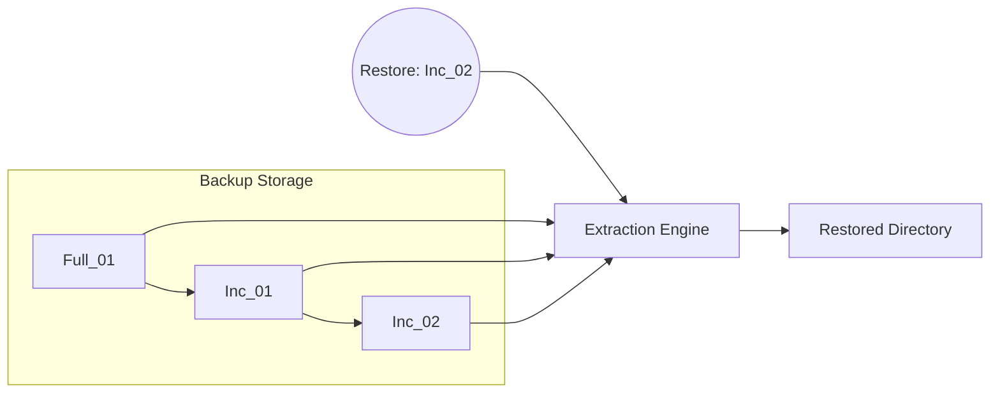

# datezip

`datezip` is a portable Bash utility designed for automated, recursive directory backups. It bridges the gap between simple "copy-paste" backups and complex enterprise solutions by providing native `.gitignore` support, intelligent incremental logic, targeted restorations, history tracking, and a robust retention policy.

## Common Use Cases

### Performing Backups
The most common operation is simply running `datezip`. The script manages rotation automatically.
```bash
# Standard backup (Full if first of the day, else Incremental)
datezip

# Major milestone: force a full backup regardless of the day
datezip --full

# Quick update: force an incremental backup
datezip --inc
```

### Auditing and Forensic Search
Use `--history` as the base command, then refine with sub-parameters.
```bash
# See everything
datezip --history

# Trace the lifecycle of specific configuration files
datezip --history --files config.json,settings.yml

# Check what happened during a specific window
datezip --history --from 20240216_090000 --to 20240216_120000
```

### Targeted Restoration
Restoration commands allow you to pluck specific versions of files from the past.
```bash
# Restore a specific version of a file found in history
datezip --restore-time 20240215_180000 --files src/app.js

# Restore the entire directory to a previous state
datezip --restore-time 20240214_080000
```

### Maintenance and Automation
Scheduled tasks typically involve quiet execution and cleanup.
```bash
# Daily maintenance via cron: backup then cleanup
datezip --quiet && datezip --cleanup --quiet
```

## Command Line Reference

The CLI is organized into primary actions and their associated modifiers (sub-commands).

### 1. Backup Operations
| Parameter | Type | Description |
| :--- | :--- | :--- |
| `datezip` | Action | Triggers a backup. Default action if no other is specified. |
| `--backup` | Action | Explicitly triggers the backup routine. |
| `--full` | Modifier | (Sub-command of backup) Forces a `FULL` state capture. |
| `--inc` | Modifier | (Sub-command of backup) Forces an incremental (`INC`) update. |
| `--cleanup` | Action | Prunes redundant increments and enforces retention policies. |
| `--keep-full N` | Modifier | (Sub-command of cleanup) Set number of full backups to retain. |
| `--keep-days N` | Modifier | (Sub-command of cleanup) Set days of history to retain. |

### 2. History & Inspection
| Parameter | Type | Description |
| :--- | :--- | :--- |
| `--history` | Action | Displays chronological file history. |
| `--files LIST` | Modifier | (Sub-command of history) Filters history to specific files. |
| `--from TS` | Modifier | (Sub-command of history) Filter start time (`YYYYMMDD_HHMMSS`). |
| `--to TS` | Modifier | (Sub-command of history) Filter end time (`YYYYMMDD_HHMMSS`). |
| `--list` | Action | Lists available backup archives and their indices. |
| `--reindex` | Action | Force-rebuilds the history cache from disk archives. |

### 3. Restoration
| Parameter | Type | Description |
| :--- | :--- | :--- |
| `--restore` | Action | Enters interactive restoration menu. |
| `--restore-time TS`| Action | Targeted restoration to a specific timestamp. |
| `--restore-index N`| Action | Restoration based on archive index `N`. |
| `--files LIST` | Modifier | (Sub-command of restore) Extract only specific files. |
| `--restore-type e\|j`| Modifier | (Sub-command of restore) `e` (Everything/Chain) or `j` (Just index). |

### 4. Global Modifiers
| Parameter | Description |
| :--- | :--- |
| `-q`, `--quiet` | Suppresses informational output; only errors are reported. |
| `--local` | Operates on current directory, skipping Git root detection. |
| `--git-root` | Forces operation from the Git project root. |

## Features

* **Git-Aware Traversal**: Automatically detects Git repositories and offers to operate from the project root.
* **Hierarchical Exclusions**: Recursively discovers and respects all `.gitignore` files within the directory tree.
* **Daily Incremental Logic**: Defaults to a `FULL` backup for the first run of the day and `INC` (incremental) for subsequent runs.
* **Forensic History**: Search and trace the lifecycle of specific files across your entire retention window using `--history`.
* **Self-Healing Cache**: A Just-In-Time (JIT) history cache that automatically syncs with the disk state (detecting manual deletions or backfills).
* **Chain Restoration**: Intelligently reconstructs project state by finding the preceding `FULL` backup and applying subsequent increments in sequence.
* **Granular Recovery**: Restore specific files from an archive rather than extracting the entire backup tree.
* **Automation-Friendly**: Supports non-interactive operations, quiet mode, and precise timestamp targeting.

## How It Works & Architecture

### 1. Backup Workflow & Incremental Engine

```mermaid
graph TD
    A[Start datezip] --> B{Action?}
    B -->|Backup| C[Resolve Target Directory]
    C --> D[Identify Latest Backup]
    D --> E{Daily Status?}
    E -->| "First Today" | F[Set Mode: FULL]
    E -->| "Subsequent" | G[Set Mode: INC]
    F --> H[Scan .gitignore Patterns]
    G --> H
    H --> I[Execute Zip]
    I --> J[End]
```
`datezip` relies on native filesystem modification times (`mtime`) rather than maintaining a heavy file-hash database, ensuring rapid execution.
- **FULL Backups**: Captures the entire directory state recursively, stripping out all resolved `.gitignore` exclusions.
- **INC Backups**: Leverages `find -newer ` to isolate only the specific files that have been modified since the last backup event, piping them directly to the `zip` utility.

### 2. Forensic History & JIT Caching

To avoid read/write overhead during routine backups, `datezip` manages a **Just-In-Time (JIT)** history cache (`backups/.datezip_history`).

```mermaid
graph TD
    H1[User: datezip --history] --> H2{Compare Disk vs Cache}
    H2 -->| "comm -13 (Deletions)" | H3[Trigger Full Reindex]
    H2 -->| "comm -23 (New Archives)" | H4[JIT Append via awk]
    H2 -->| "Match" | H5[Filter & Display]
```
- The cache is strictly evaluated and updated *only* when the `--history` command is invoked.
- It uses the POSIX `comm` utility to perform a highly efficient set-difference analysis between the `YYYYMMDD_HHMMSS` timestamps currently on disk and those indexed in the cache.
- **Deletions**: If a ZIP archive is missing from the disk (e.g., due to manual deletion or the cleanup routine), the cache is fully rebuilt from the remaining archives to prevent ghost entries.
- **Additions**: New ZIPs are instantly appended to the end of the cache using `unzip -Z1` and `awk`, entirely sidestepping the computational penalty of a full reindex.

### 3. Restoration Chain Overlay


When restoring to a specific point in time, `datezip` locates the target archive based on the provided timestamp. It then traverses backward to identify the `FULL` baseline backup that initiated the chain. 

The extraction engine overlays these archives sequentially (extracting `FULL`, then `INC 1`, then `INC 2`). This linear overlay mathematically guarantees that the final restored directory structure is a perfect reflection of the filesystem at that exact timestamp, handling unchanged, modified, and intermediate files seamlessly.

### 4. Cleanup & Retention Logic

`datezip --cleanup` maintains storage hygiene through a dual-policy approach without requiring complex configuration tracking:
1. **Orphan Pruning**: Safely deletes all incremental backups (`INC`) that are chronologically older than the most recent `FULL` backup, as they are redundant for current state recovery.
2. **Retention Thresholds**: Retains the last `N` full backups **or** all backups from the last `M` days, evaluating both and applying whichever rule yields the larger retention set.
3. **Cache Sync**: Automatically triggers a history reindex if any archives are purged during the run, ensuring the audit trail remains a perfectly synchronized reflection of the disk state.

## License

MIT
