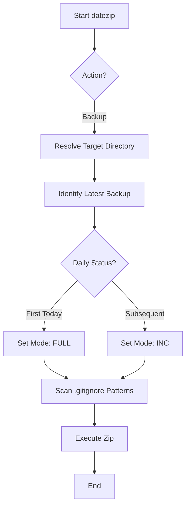
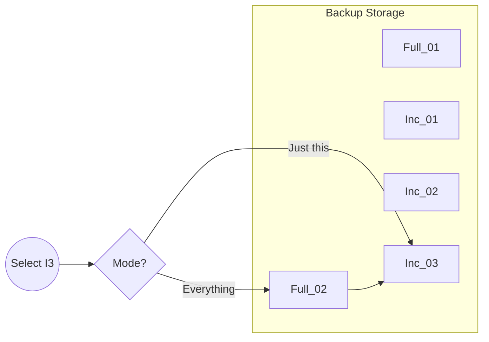

# datezip

`datezip` is a portable Bash utility designed for automated, recursive directory backups. It bridges the gap between simple "copy-paste" backups and complex enterprise solutions by providing native `.gitignore` support, intelligent incremental logic, and a robust retention policy.

## Features

* **Git-Aware Traversal**: Automatically detects Git repositories and offers to operate from the project root.

* **Hierarchical Exclusions**: Recursively discovers and respects all `.gitignore` files within the directory tree, even if the directory is not a formal Git repository.

* **Daily Incremental Logic**: Defaults to a `FULL` backup for the first run of the day and `INC` (incremental) for subsequent runs, capturing only files modified since the last backup.

* **Chain Restoration**: Intelligently reconstructs project state by finding the preceding `FULL` backup and applying subsequent increments in sequence.

* **Retention Management**: Automated cleanup based on a "whichever is greater" policy for backup count and age.

## Architecture

### Backup Workflow



### Restoration Chain



## Requirements

* **Bash**: 4.0+ (utilizes `mapfile` and `shopt`)

* **Zip/Unzip**: Standard compression utilities

* **Find**: POSIX compliant `find` for file discovery

## Installation

To install `datezip` globally on a Unix-like system:

```
# Copy the script to a directory in your PATH
sudo cp datezip.sh /usr/local/bin/datezip

# Ensure it is executable
sudo chmod +x /usr/local/bin/datezip
```

## Usage

### Basic Commands

| **Command** | **Description** | 
 | ----- | ----- | 
| `datezip` | Performs a backup (Full if first of the day, otherwise Incremental) | 
| `datezip --full` | Forces a full backup regardless of date | 
| `datezip --restore` | Starts interactive restoration mode | 
| `datezip --cleanup` | Removes obsolete increments and prunes old full backups | 

### Advanced Options

* `--local`: Skips Git root detection and operates strictly on the current working directory.

* `--git-root`: Forces the script to operate from the Git project root.

* `--keep-full N`: Number of full backups to keep (Default: 10).

* `--keep-days N`: Number of days to retain backups (Default: 14).

## Configuration

When running inside a Git repository, `datezip` saves your preference (Root vs. Subdir) in a hidden `.datezip` file at the project root.

```
# .datezip content example
root
```

## How It Works

### File Filtering

The script performs a recursive search for all `.gitignore` files. It translates Git-style patterns into `zip` exclusion arguments.

1. Patterns starting with `/` are anchored to the specific directory containing that `.gitignore`.

2. Other patterns match globally within that subdirectory.

3. Internal defaults always exclude `.git/`, `backups/`, and `.datezip`.

### Incremental Logic

Incremental backups are identified by the `_INC.zip` suffix. The script uses the `find -newer` command against the most recent backup file to identify changed assets, ensuring high performance without needing a file-hash database.

### Cleanup Logic

The cleanup process follows two rules:

1. **Orphan Removal**: Deletes any `INC` backup that is chronologically older than the latest `FULL` backup (since they are redundant for current state restoration).

2. **Retention Policy**: Keeps the most recent $N$ full backups **OR** all full backups within the last $M$ days, whichever resulting set is larger.

## License

MIT
